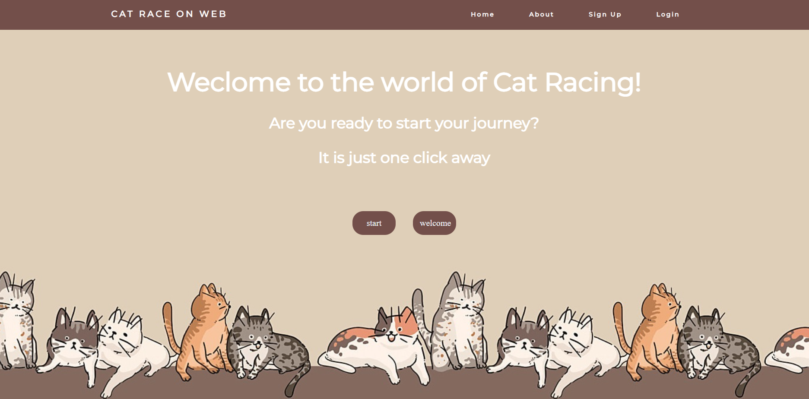
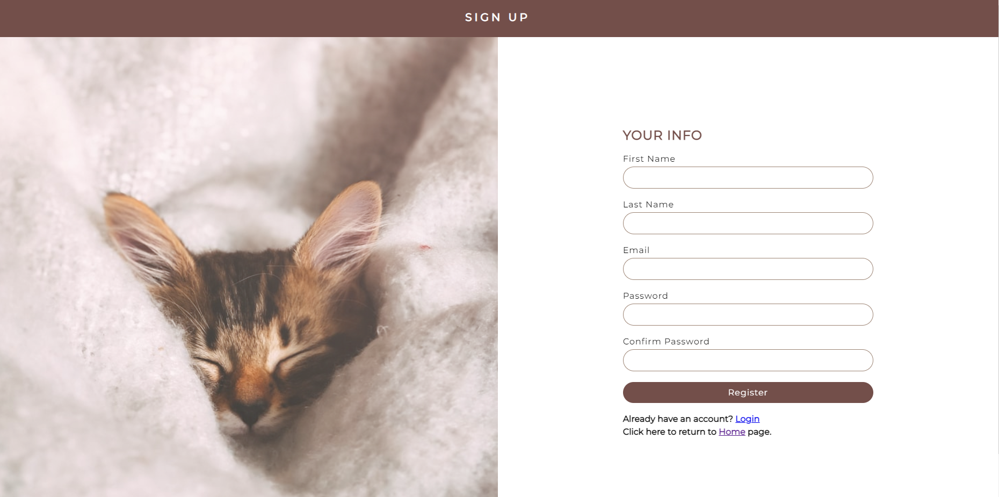
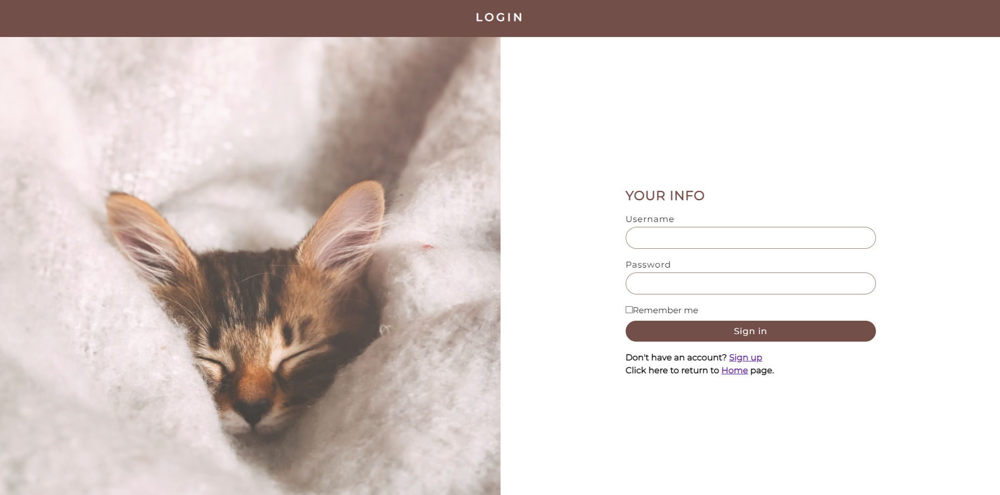
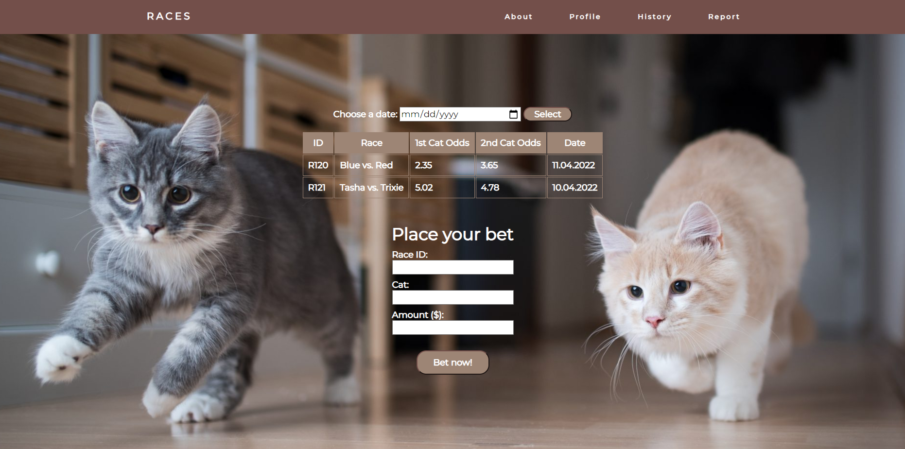
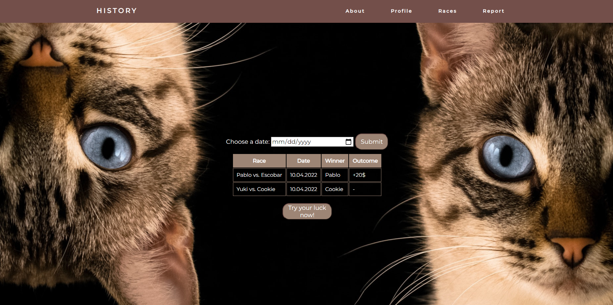
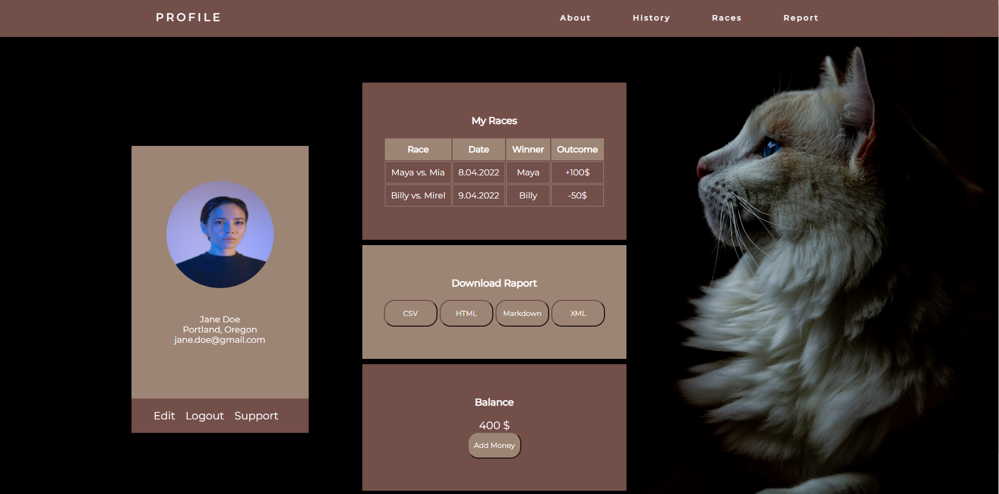
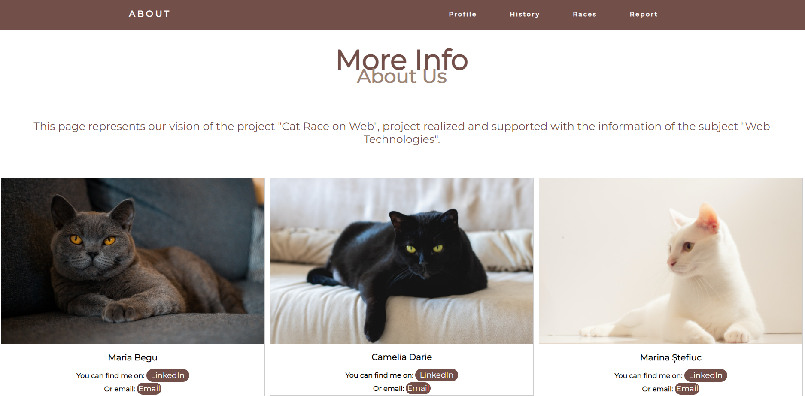
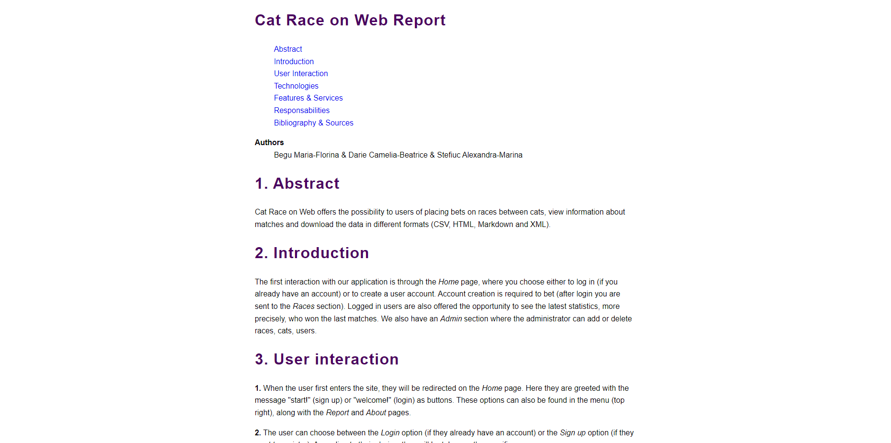

# Cat Race on Web 

Sa se implementeze o aplicatie Web oferind utilizatorilor autentificati posibilitatea realizarii de pariuri referitoare la cursele de feline. Sistemul va permite vizualizarea unui istoric al pariurilor si al rezultatelor aferente pentru fiecare concurent (pisica, motan). Se va genera, de asemenea, atat un raport -- minimal, in formatele CSV, HTML, Markdown si XML -- oferind starea actuala a pariurilor, cat si calendarul (disponibil in formatul iCalendar) despre desfasurarea curselor din viitorul apropiat. Pentru fiecare cursa, va exista un termen-limita de realizare a pariurilor. Bonus: simularea serviciului de plata electronica vizand pariurile efectuate.

## Componenta I

Acestea sunt paginile implementate de noi:

- Home: Aceasta este pagina de inceput. Aici utilizatorii pot alege sa se logheze (butonul welcome) sau sa se inregistreze (butorul start).  

- Sign-up: Aici utilizatorii isi pot face un cont pe site. Acestia au optiunea sa se intoarca inapoi in Home sau sa se logheze daca au deja cont.

-  Log-in: Clientii se pot loga cu un cont deja existent. De asemenea, pot alege daca sa li se retina parola sau nu. Dupa ce acestia se vor loga, vor fi redirectionati catre pagina Races.

- Races: Cursele curente pot fi vizualizate pe aceasta pagina. Daca utilizatorii isi doresc sa parieze, acestia o pot face aici. Datele necesare pentru a pune un bilet sunt: ID-ul cursei, pisica pe care se doreste a paria si suma alocata.

  

- History: Pot fi gasite meciurile din trecut in functie de data.

  

- Profil: In aceasta pagina se pot vizualiza datele personale ( nume, locatie, email), toate cursele clientului, suma pe care acesta o are disponibila si de asemenea poate sa descare un raport cu toate cursele prezentate anterior in formatul dorit (  CSV, HTML, Markdown si XML ).

  

- About: Aici se regasesc detalii despre membrii echipei si cum pot fi contactati. Daca se alege optiunea de email, se va deschide o fereasta pentru a se trimite email la o adresa deja stabilita.

 

 - Report: Cuprinde date despre modul in care a fost realizata pagina, functiile acesteia si detalii despre contributia fiecarui membru.

 
